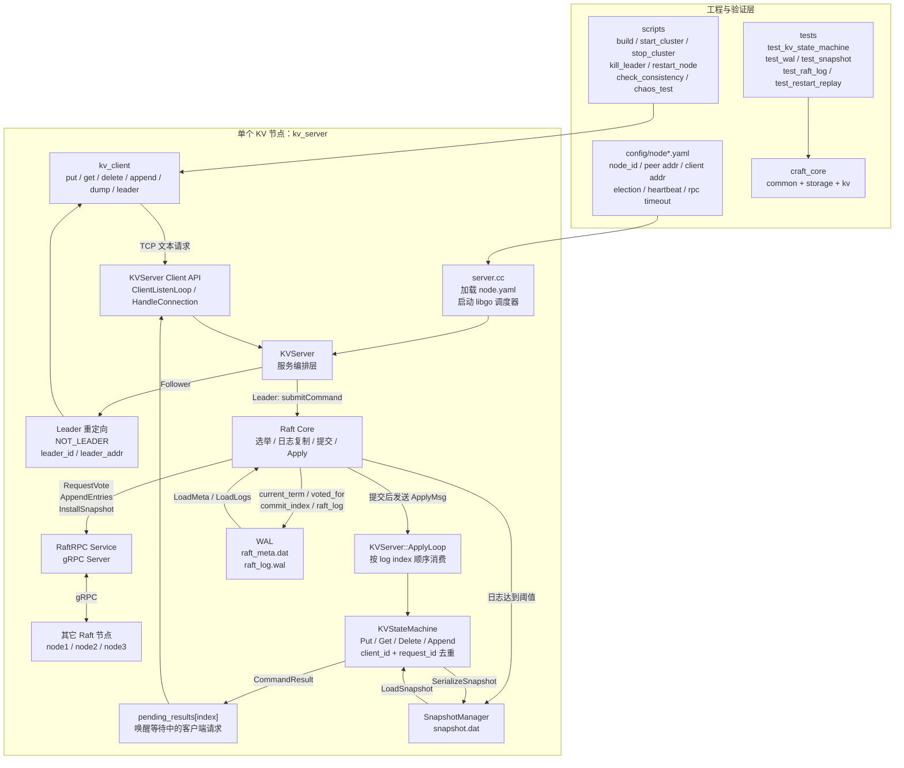
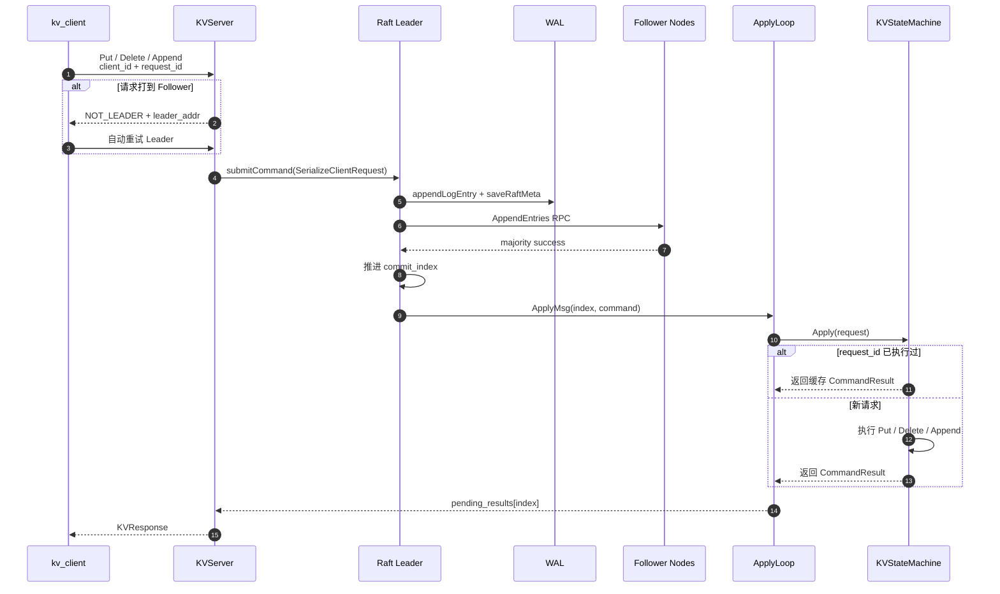
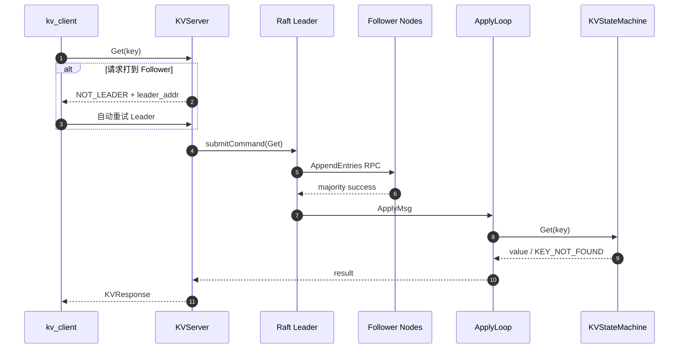
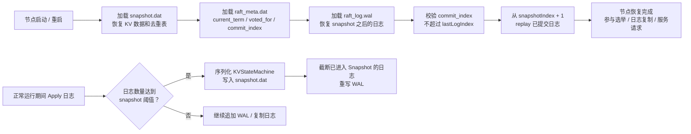

# 基于 Raft 的强一致分布式 KV 存储系统

> 一个基于 Raft 共识算法实现的强一致分布式 KV 存储系统。项目基于 `cq-cdy/cRaft` 二次开发，在原有 Raft 框架基础上补齐了 KV 状态机、请求去重、WAL 持久化、节点重启恢复、基础 Snapshot、Leader 重定向和故障测试脚本。

本项目定位是一个“简历可控版”的分布式存储系统，重点展示 Raft 共识、线性一致读写、状态机 Apply、WAL 持久化、Snapshot 压缩、节点故障恢复等核心能力。

它不是工业级数据库，也不是 etcd 的完整替代品，而是一个用于学习、展示和验证分布式一致性机制的工程化项目。

---

## 目录

- [项目特点](#项目特点)
- [技术栈](#技术栈)
- [系统架构](#系统架构)
- [请求流程](#请求流程)
- [核心设计](#核心设计)
- [目录结构](#目录结构)
- [快速开始](#快速开始)
- [常用命令](#常用命令)
- [测试与验证](#测试与验证)
- [当前限制](#当前限制)
- [后续优化方向](#后续优化方向)
- [License](#license)

---

## 项目特点

### 强一致 KV 读写

- 支持 `Put`、`Get`、`Delete`、`Append` 四类 KV 操作。
- 所有写请求都会通过 Raft 日志提交后再 Apply 到状态机。
- 当前版本中 `Get` 也走 Raft 日志提交，用于保证线性一致性。
- 客户端可以访问任意节点；如果请求打到 follower，follower 会返回 Leader 地址，客户端自动重试 Leader。

### Raft 共识能力

- 支持三节点 Raft 集群。
- 支持 Leader 选举。
- 支持 AppendEntries 日志复制。
- 支持多数派提交。
- 支持节点宕机后重新加入并追赶日志。
- 支持基础 InstallSnapshot / Snapshot 相关流程。

### 状态机与请求去重

- KV 状态机按 Raft 日志顺序执行命令。
- 通过 `client_id + request_id` 实现请求去重。
- 对 `Append` 这类非幂等操作，避免客户端超时重试导致重复执行。
- 去重表会进入 Snapshot，保证重启恢复后仍然不会重复执行历史请求。

### 持久化与恢复

- 使用本地文件实现 WAL 和 Snapshot。
- WAL 保存：
  - `current_term`
  - `voted_for`
  - `commit_index`
  - `last_applied`
  - Raft 日志记录
- Snapshot 保存：
  - KV 数据
  - 请求去重表
  - `last_included_index`
  - `last_included_term`
- 节点重启时先恢复 Snapshot，再加载 WAL，并 replay Snapshot 之后已经提交的日志。

### 故障测试脚本

项目提供三节点启动、停止、Leader 故障、节点重启、一致性检查和基础 chaos 测试脚本，便于验证分布式场景下的数据一致性。

---

## 技术栈

- C++17
- 少量稳定 C++20 写法
- Raft 共识算法
- libgo 协程
- gRPC / Protobuf
- spdlog 日志
- 本地文件 WAL
- 本地文件 Snapshot
- CMake
- Bash 脚本

---

## 系统架构

整体采用分层设计：

- 客户端接入层：`kv_client`
- KV 服务层：`KVServer`
- Raft 共识层：`Raft`
- 状态机层：`KVStateMachine`
- 持久化层：`WAL`、`Snapshot`
- 工程验证层：构建脚本、启动脚本、故障测试脚本、core tests



---

## 请求流程

### 写请求流程

以 `put name chaos` 为例：

1. 客户端向任意节点发送请求。
2. 如果请求到 follower，follower 返回 `NOT_LEADER` 和当前 Leader 的客户端地址。
3. 客户端自动重试 Leader。
4. Leader 将请求序列化为 Raft command。
5. Raft Leader 先写 WAL，再追加内存日志。
6. Leader 通过 AppendEntries 将日志复制给 follower。
7. 日志复制到多数派后推进 `commit_index`。
8. Apply 协程收到已提交日志。
9. KV 状态机按日志顺序执行命令。
10. 执行结果通过 `pending_results[index]` 返回给等待中的客户端请求。



### 读请求流程

当前版本中，`Get` 也会走 Raft 日志提交：



这样实现简单直接，可以保证线性一致性。后续可以优化为 ReadIndex 或 Lease Read，以减少读请求写入 Raft 日志的开销。

---

## 核心设计

### 1. KV 状态机

KV 状态机负责真正执行用户命令。

支持操作：

| 操作 | 说明 |
| --- | --- |
| `Put` | 写入或覆盖 key |
| `Get` | 读取 key |
| `Delete` | 删除 key |
| `Append` | 在已有 value 后追加内容 |

状态机内部维护：

```text
kv_:
  key -> value

last_request_:
  client_id -> {request_id, last_result}
```

其中 `last_request_` 用于请求去重。

---

### 2. 请求去重

客户端请求中包含：

```text
client_id
request_id
op_type
key
value
```

状态机执行命令前会检查：

```text
如果 request_id <= last_request_[client_id].request_id
    直接返回缓存的 last_result
否则
    执行命令并更新 last_request_
```

这样可以解决客户端超时重试导致的重复执行问题。

例如：

```bash
./bin/kv_client --client_id=c1 --request_id=100 append name _raft
./bin/kv_client --client_id=c1 --request_id=100 append name _raft
```

第二次请求不会重复 append。

---

### 3. Leader 重定向

客户端可以连接任意节点。

如果请求命中 follower，服务端返回：

```text
NOT_LEADER
leader_id
leader_addr
```

客户端收到后会自动切换到 Leader 节点重试。

这让客户端使用更简单，不需要一开始就知道谁是 Leader。

---

### 4. WAL 持久化

每个节点的数据目录类似：

```text
data/node1/
  raft_meta.dat
  raft_log.wal
  snapshot.dat
```

`raft_meta.dat` 保存 Raft 元信息：

```text
current_term
voted_for
commit_index
last_applied
```

`raft_log.wal` 保存 Raft 日志：

```text
index
term
command
```

WAL 使用 frame 格式写入，并带有 checksum，用于加载时识别损坏或不完整的尾部数据。

---

### 5. Snapshot

Snapshot 用于日志压缩和重启恢复。

Snapshot 保存两类信息：

```text
KV 数据：
  key -> value

请求去重表：
  client_id -> {request_id, last_result}
```

当 Raft 日志数量达到配置阈值时，节点会触发 Snapshot：

```yaml
snapshot:
  max_log_entries: 10000
  snapshot_dir: ./data/node1
```

Snapshot 生成后，已经进入 Snapshot 的日志可以从 WAL 中截断。

---

### 6. 重启恢复

节点重启时恢复流程：



恢复时不能盲目信任持久化的 `last_applied`，否则可能跳过 crash 前已经提交但尚未进入 Snapshot 的日志。

本项目采用：

```text
last_applied = snapshotIndex
从 snapshotIndex + 1 replay 到 commit_index
```

保证未进入 Snapshot 的已提交日志不会丢失。

---

## 目录结构

核心目录如下：

```text
RaftKV-StrongConsistency/
├── client/
│   └── kv_client.cc              # KV 命令行客户端
├── config/
│   ├── node1.yaml                # 节点 1 配置
│   ├── node2.yaml                # 节点 2 配置
│   └── node3.yaml                # 节点 3 配置
├── docs/
│   ├── build_alinux3.md          # Alibaba Cloud Linux 3 构建说明
│   └── server_validation.md      # 服务器验证清单
├── include/
│   ├── common/                   # 配置加载
│   ├── kv/                       # KV 请求、响应、状态机、服务接口
│   └── storage/                  # WAL / Snapshot 接口
├── proto/
│   └── README.md                 # proto 说明
├── scripts/
│   ├── build.sh                  # 构建脚本
│   ├── start_cluster.sh          # 启动三节点
│   ├── stop_cluster.sh           # 停止三节点
│   ├── kill_leader.sh            # 杀掉当前 Leader
│   ├── restart_node.sh           # 重启指定节点
│   ├── check_consistency.sh      # 检查三节点数据一致性
│   └── chaos_test.sh             # 简单故障测试
├── src/
│   ├── common/                   # 配置解析
│   ├── craft/                    # Raft 框架头文件
│   ├── kv/                       # KV 服务与状态机实现
│   ├── protos/                   # 实际参与构建的 raft.proto
│   ├── raft/                     # Raft 核心逻辑
│   ├── rpc/                      # Protobuf / gRPC 生成代码
│   └── storage/                  # WAL / Snapshot / 文件工具
├── tests/
│   ├── test_kv_state_machine.cc
│   ├── test_wal.cc
│   ├── test_snapshot.cc
│   ├── test_raft_log.cc
│   └── test_restart_replay.cc
├── CMakeLists.txt
├── server.cc                     # kv_server 入口
└── README.md
```

---

## Proto 说明

当前 CMake 使用的 Raft RPC 定义位于：

```text
src/protos/raft.proto
```

生成代码保留在：

```text
src/rpc/
```

根目录下的 `proto/` 仅保留说明文件，避免和实际构建流程混淆。

Raft RPC 包括：

- `requestVoteRPC`
- `appendEntries`
- `installSnapshot`
- `TransferSnapShotFile`
- `submitCommand`

---

## 快速开始

### 1. 环境要求

完整 Raft server 推荐在 Linux 环境中构建和验证。

需要依赖：

- gcc / g++
- cmake
- make
- protobuf
- protoc
- grpc_cpp_plugin
- gRPC C++
- libgo
- spdlog
- absl

如果只想先验证 KV、WAL、Snapshot、重启 replay，可以只构建 core tests，不需要完整 gRPC / libgo 环境。

---

### 2. 构建 core tests

core tests 不依赖完整 Raft server：

```bash
BUILD_RAFT=OFF bash scripts/build.sh
```

这会构建并运行：

```text
test_kv_state_machine
test_wal
test_snapshot
test_raft_log
test_restart_replay
```

---

### 3. 完整构建

依赖安装完成后执行：

```bash
bash scripts/build.sh
```

构建产物默认输出到：

```text
bin/
lib/
```

其中：

```text
bin/kv_client
bin/kv_server
```

---

### 4. 启动三节点集群

```bash
bash scripts/start_cluster.sh
```

默认 Raft RPC 端口：

```text
node1: 127.0.0.1:8001
node2: 127.0.0.1:8002
node3: 127.0.0.1:8003
```

默认 KV Client 端口：

```text
node1: 127.0.0.1:9001
node2: 127.0.0.1:9002
node3: 127.0.0.1:9003
```

查看当前 Leader：

```bash
./bin/kv_client leader
```

---

## 常用命令

### 写入 key

```bash
./bin/kv_client put name chaos
```

期望输出：

```text
OK
```

---

### 读取 key

```bash
./bin/kv_client get name
```

期望输出：

```text
chaos
```

---

### 追加 value

```bash
./bin/kv_client append name _raft
```

期望输出：

```text
chaos_raft
```

再次读取：

```bash
./bin/kv_client get name
```

期望输出：

```text
chaos_raft
```

---

### 删除 key

```bash
./bin/kv_client delete name
```

期望输出：

```text
OK
```

再次读取：

```bash
./bin/kv_client get name
```

期望输出：

```text
KEY_NOT_FOUND: key not found
```

---

### 查看 Leader

```bash
./bin/kv_client leader
```

输出格式：

```text
leader_id leader_addr
```

示例：

```text
1 127.0.0.1:9001
```

---

### 查看本地节点数据

```bash
./bin/kv_client dump
```

---

### 指定服务器列表

```bash
./bin/kv_client --servers=127.0.0.1:9001,127.0.0.1:9002,127.0.0.1:9003 get name
```

---

### 指定 client_id 和 request_id

用于测试请求去重：

```bash
./bin/kv_client --client_id=c1 --request_id=100 append name _raft
./bin/kv_client --client_id=c1 --request_id=100 append name _raft
```

相同 `client_id + request_id` 的请求只会执行一次。

---

## 测试与验证

### Core Tests

执行：

```bash
BUILD_RAFT=OFF bash scripts/build.sh
```

覆盖内容：

| 测试 | 说明 |
| --- | --- |
| `test_kv_state_machine` | 验证 KV 状态机和请求去重 |
| `test_wal` | 验证 WAL meta 和日志读写 |
| `test_snapshot` | 验证 Snapshot 保存和加载 |
| `test_raft_log` | 验证 Raft 日志编码和恢复 |
| `test_restart_replay` | 验证重启后 replay 已提交日志 |

---

### 三节点基础验证

```bash
bash scripts/start_cluster.sh

./bin/kv_client leader

./bin/kv_client put name chaos
./bin/kv_client get name
./bin/kv_client append name _raft
./bin/kv_client get name
./bin/kv_client delete name
./bin/kv_client get name || true
```

---

### Leader 故障验证

```bash
old_leader=$(./bin/kv_client leader | awk '{print $1}')

bash scripts/kill_leader.sh

sleep 3

./bin/kv_client leader
./bin/kv_client put after_leader_kill ok
./bin/kv_client get after_leader_kill

bash scripts/restart_node.sh "$old_leader"

sleep 3

bash scripts/check_consistency.sh
```

期望结果：

- 旧 Leader 被 kill 后，集群可以重新选主。
- 新 Leader 可以继续处理写请求。
- 旧 Leader 重启后可以追上日志。
- 三个节点最终数据一致。

---

### Follower 掉线恢复验证

```bash
leader=$(./bin/kv_client leader | awk '{print $1}')

follower=1
if [ "$follower" = "$leader" ]; then
  follower=2
fi

kill "$(cat run/node${follower}.pid)"
rm -f "run/node${follower}.pid"

./bin/kv_client put follower_down_key ok

bash scripts/restart_node.sh "$follower"

sleep 5

bash scripts/check_consistency.sh
```

期望结果：

- follower 掉线期间不影响多数派写入。
- follower 重启后可以追上 Leader。
- 三节点最终数据一致。

---

### 节点重启恢复验证

```bash
./bin/kv_client put restart_key restart_value

bash scripts/stop_cluster.sh
bash scripts/start_cluster.sh

./bin/kv_client get restart_key
```

期望输出：

```text
restart_value
```

---

### Snapshot 验证

可以临时把 `config/node*.yaml` 中的 Snapshot 阈值调小，例如：

```yaml
snapshot:
  max_log_entries: 20
```

然后写入一批数据：

```bash
for i in $(seq 1 100); do
  ./bin/kv_client put "snap${i}" "value${i}" >/dev/null
done

find data -name snapshot.dat -ls

bash scripts/stop_cluster.sh
bash scripts/start_cluster.sh

./bin/kv_client get snap100
bash scripts/check_consistency.sh
```

期望结果：

- 生成 `snapshot.dat`
- 重启后仍然可以读取数据
- 三节点最终数据一致

---

### Chaos 测试

```bash
bash scripts/chaos_test.sh
```

用于进行简单故障注入和一致性验证。

---

## 配置说明

以 `config/node1.yaml` 为例：

```yaml
node_id: 1
listen_addr: 127.0.0.1:8001
client_addr: 127.0.0.1:9001
data_dir: ./data/node1

peers:
  - id: 1
    addr: 127.0.0.1:8001
    client_addr: 127.0.0.1:9001
  - id: 2
    addr: 127.0.0.1:8002
    client_addr: 127.0.0.1:9002
  - id: 3
    addr: 127.0.0.1:8003
    client_addr: 127.0.0.1:9003

snapshot:
  max_log_entries: 10000
  snapshot_dir: ./data/node1

raft:
  election_timeout_ms_min: 300
  election_timeout_ms_max: 600
  heartbeat_interval_ms: 100
  rpc_timeout_ms: 300
```

字段说明：

| 字段 | 说明 |
| --- | --- |
| `node_id` | 当前节点 ID |
| `listen_addr` | Raft RPC 监听地址 |
| `client_addr` | KV 客户端访问地址 |
| `data_dir` | WAL 数据目录 |
| `peers` | 集群节点列表 |
| `snapshot.max_log_entries` | 触发 Snapshot 的日志数量阈值 |
| `snapshot.snapshot_dir` | Snapshot 保存目录 |
| `raft.election_timeout_ms_min` | 最小选举超时 |
| `raft.election_timeout_ms_max` | 最大选举超时 |
| `raft.heartbeat_interval_ms` | Leader 心跳间隔 |
| `raft.rpc_timeout_ms` | Raft RPC 超时时间 |

---

## 当前限制

当前项目仍是学习和简历展示性质，和工业级 KV 存储系统相比还有以下限制：

- 不支持动态成员变更。
- 不支持分片。
- 不支持多 Raft Group。
- 不支持高性能 ReadIndex / Lease Read。
- `Get` 当前也进入 Raft 日志，读性能不是最优。
- Snapshot 仍是基础版本。
- WAL checksum 和异常恢复逻辑还可以继续增强。
- 网络协议是简单文本协议，不是完整生产级客户端协议。
- 没有实现完整权限控制、限流、监控、指标和运维接口。

---

## 后续优化方向

- 实现 ReadIndex，减少线性一致读的日志写入开销。
- 实现 Lease Read，提高读性能。
- 完善 InstallSnapshot。
- 完善 WAL checksum 和 crash recovery。
- 支持动态节点扩缩容。
- 支持分片 KV。
- 支持批量日志复制。
- 支持客户端连接池。
- 增加 benchmark。
- 增加更完整的 chaos test。
- 增加 metrics 和监控接口。

---

## 适合展示的技术点

这个项目可以重点展示以下能力：

- Raft 选举、日志复制、提交和 Apply 流程理解。
- 线性一致 KV 请求链路设计。
- 状态机和共识层解耦。
- `client_id + request_id` 幂等去重机制。
- WAL 持久化设计。
- Snapshot 日志压缩和重启恢复。
- Leader 重定向和客户端自动重试。
- 多节点故障恢复和一致性验证。
- C++ 工程组织、CMake 构建、脚本化测试。

---

## License

本项目基于开源项目 `cq-cdy/cRaft` 二次开发，并保留原项目 LICENSE。

具体请查看仓库中的 `LICENSE` 文件。
