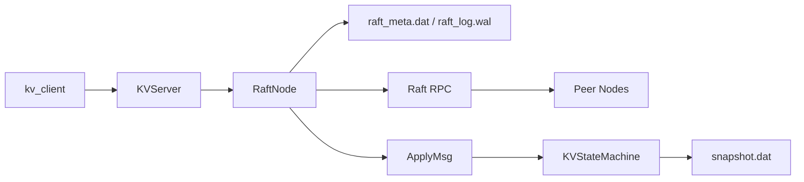

# 基于 Raft 的强一致分布式 KV 存储系统

本项目基于开源项目 [cq-cdy/cRaft](https://github.com/cq-cdy/cRaft) 二次开发，并保留原项目 LICENSE。原项目提供了基于 C++20、libgo、gRPC、Protobuf 的 Raft 共识框架；本项目在原有框架上补齐 KV 状态机、请求去重、WAL 持久化、节点重启恢复、基础 Snapshot、Leader 重定向和故障测试脚本。

项目定位是“简历可控版”的强一致分布式 KV 系统，不是工业级数据库，也不是 etcd 的完整替代品。

## 技术栈

- C++17/少量稳定 C++20 写法
- libgo 协程
- gRPC / Protobuf 节点间 Raft RPC
- spdlog 日志
- 本地文件 WAL 和 Snapshot
- Bash 故障测试脚本

## 本项目新增内容

- KV 状态机：`Put`、`Get`、`Delete`、`Append`
- 所有写请求通过 Raft 日志提交后再 Apply
- `Get` 当前也走 Raft 日志，保证线性一致性
- `client_id + request_id` 请求去重
- WAL 持久化：`current_term`、`voted_for`、`commit_index`、`raft_log`
- 节点重启恢复：Snapshot + WAL replay
- 基础 Snapshot：主要用于日志压缩和重启恢复
- Leader 重定向：follower 返回 `NOT_LEADER` 和 `leader_addr`
- 三节点启动、停止、故障和一致性检查脚本

## 架构



## Proto 说明

当前 CMake 使用的 Raft RPC 定义位于 `src/protos/raft.proto`，生成代码保留在 `src/rpc/`。根目录 `proto/` 仅保留说明文件，避免和实际构建流程混淆。

## 请求流程

写请求流程：

1. 客户端发送 `Put/Delete/Append`，携带 `client_id` 和 `request_id`。
2. 如果请求到 follower，返回 `NOT_LEADER` 和 leader 地址。
3. 客户端自动重试 leader。
4. leader 将请求封装成 Raft 日志，先写 WAL，再追加内存日志。
5. 日志复制到多数派后推进 `commit_index`。
6. Apply 协程按 index 顺序将日志交给 KV 状态机。
7. KV 状态机执行命令并返回结果。

读请求流程：

当前版本 `Get` 也走 Raft 日志提交，保证线性一致性。ReadIndex / Lease Read 只作为后续优化方向。

## 请求去重

KV 状态机维护：

```text
client_id -> {max_request_id, last_result}
```

当客户端超时重试时，如果 `request_id` 已经执行过，状态机直接返回缓存结果，不会重复执行写操作。去重表会进入 Snapshot，否则节点重启或安装 Snapshot 后可能重复执行 `Append` 这类非幂等请求。

## WAL 与重启恢复

每个节点的数据目录：

```text
data/node1/
  raft_meta.dat
  raft_log.wal
  snapshot.dat
```

恢复流程：

1. 加载 Snapshot，恢复 KV 数据和去重表到 `last_included_index`。
2. 加载 WAL 和 Raft meta。
3. 不盲目信任持久化的 `last_applied`。
4. 从 `snapshotIndex + 1` 开始 replay 已提交日志直到 `commit_index`。
5. 保证未进入 Snapshot 的已提交日志不会丢失。

## 快速启动

构建：

```bash
bash scripts/build.sh
```

只构建 core tests，不构建 gRPC/libgo Raft server：

```bash
BUILD_RAFT=OFF bash scripts/build.sh
```

启动三节点：

```bash
scripts/start_cluster.sh
```

客户端示例：

```bash
./bin/kv_client put name chaos
./bin/kv_client get name
./bin/kv_client append name _raft
./bin/kv_client delete name
```

故障测试：

```bash
scripts/kill_leader.sh
scripts/restart_node.sh 1
scripts/check_consistency.sh
scripts/chaos_test.sh
```

## 测试

当前核心测试：

- `test_kv_state_machine`
- `test_wal`
- `test_snapshot`
- `test_raft_log`
- `test_restart_replay`

## 服务器验证

完整 Raft server 需要在 Linux 环境安装 gRPC、Protobuf、libgo、spdlog、absl 等依赖后验证。推荐按 `docs/build_alinux3.md` 和 `docs/server_validation.md` 依次完成 core tests、完整构建、三节点启动、Leader 故障、Follower 恢复、节点重启和基础 Snapshot 验证。

## 后续优化方向

- ReadIndex / Lease Read
- 动态节点扩缩容
- 分片 KV
- 批量日志复制
- 更完整 WAL checksum
- 更完整 InstallSnapshot
