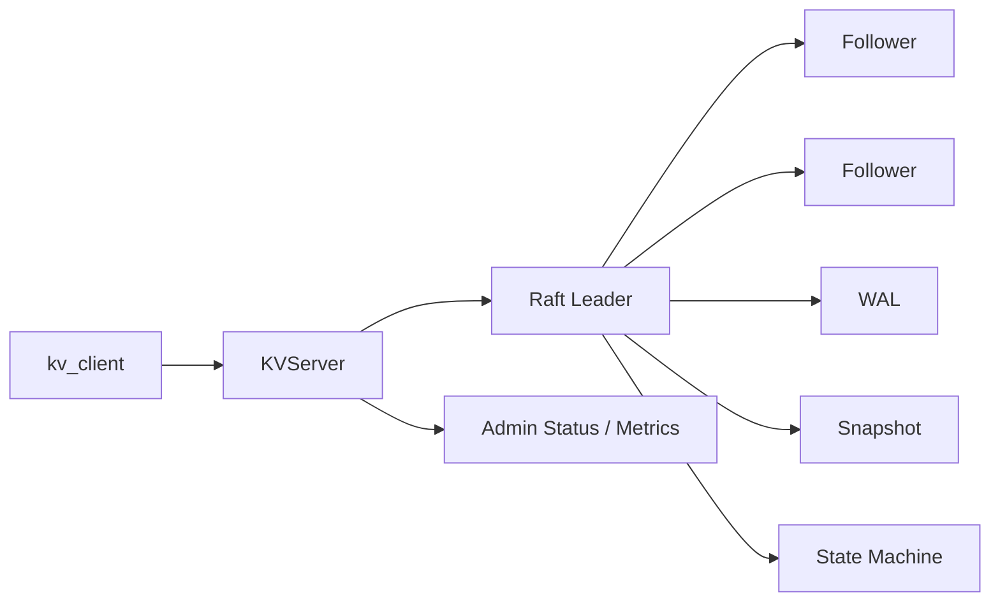

# RaftKV-StrongConsistency

一个基于 C++17、Raft 和 gRPC 实现的固定三节点强一致 KV 存储工程原型。

RaftKV v1.0 聚焦单 Raft Group、固定三节点、强一致 KV、崩溃恢复、可观测性和系统化验证。
## 项目亮点

| 类别 | 能力 |
| --- | --- |
| 一致性 | Raft 多数派提交、线性一致读、`client_id + request_id` 请求去重 |
| 持久化 | WAL、checksum、坏尾截断、meta fail closed |
| Snapshot | 原子保存、重启恢复、InstallSnapshot |
| Leader 稳定性 | No-op Barrier、PreVote、CheckQuorum |
| 读优化 | `log` read 与 ReadIndex |
| 复制优化 | 有界 AppendEntries batching |
| 可观测性 | Admin Status API、Metrics、CLI `status` |
| 验证体系 | smoke、chaos、linearizability、slow follower、nightly |
| 性能工具 | Benchmark v2、复制矩阵 |

## 核心架构


```mermaid
flowchart LR
  C["kv_client"] --> S["KVServer"]
  S --> L["Raft Leader"]
  L --> F1["Follower"]
  L --> F2["Follower"]

  L --> WAL["WAL"]
  L --> SNAP["Snapshot"]
  L --> SM["State Machine"]
  S --> ADM["Admin Status / Metrics"]
```

完整架构、读写路径和恢复流程见：[docs/architecture.md](docs/architecture.md)。

## 已实现能力

### Raft 共识

- Leader 选举、RequestVote、AppendEntries。
- 多数派复制后提交，状态机按 log index 顺序 apply。
- Leader 故障切换、Follower 重启追赶。
- Snapshot 边界下通过 InstallSnapshot 让落后 Follower 恢复。

### 持久化恢复

- WAL frame 带长度字段和 checksum。
- partial / corrupted WAL tail 按崩溃恢复输入处理并安全截断。
- meta 损坏时 fail closed，避免带着不可信元数据启动。
- Snapshot 原子写入，包含 KV 数据、去重表、last included index/term。
- 重启时先恢复 Snapshot，再 replay Snapshot 之后已提交但未 apply 的 WAL 日志。
- 持久化路径使用原子写入、`fsync` 和父目录 sync。

### 线性一致读

RaftKV 支持两种读模式：

| 模式 | 行为 |
| --- | --- |
| `log` | `Get` 进入 Raft 日志，复制到多数派并 apply 后返回。实现简单但每次读都会写 WAL。 |
| `read_index` | Leader 通过多数派 heartbeat / AppendEntries 确认当前领导权，等待本地 apply 到对应 commit index 后本地读取。 |

ReadIndex 不为每次 `Get` 追加业务日志。新 Leader 需要先通过 No-op Barrier 建立当前任期提交屏障，避免在未确认当前任期领导权时读取旧状态。

### Leader 稳定性

- No-op Barrier：Leader 上任后追加内部 no-op，建立当前 term commit barrier。
- PreVote：减少隔离节点无意义地抬高 term。
- CheckQuorum：Leader 失去多数派联系时主动退位。

### 复制优化

- `raft.max_append_entries_per_rpc` 控制每次 AppendEntries 最多携带的日志条数。
- 默认最大 batch size 为 `64`。
- 空 heartbeat 不推进 `matchIndex`。
- 当前 `max_inflight_append_entries_per_peer=1`，尚未实现 inflight pipeline。

### 请求幂等

客户端请求使用：

```text
client_id + request_id
```

状态机保存最近请求结果，避免客户端重试导致 `Append` 等非幂等操作被重复执行。该去重表会随 Snapshot 恢复。

## 性能对比快照

数据来自单机 2 vCPU、小内存服务器，只用于相对优化对比和回归观察，不作为生产级 benchmark 宣传。完整数据见：[docs/performance_report.md](docs/performance_report.md)。

### ReadIndex 对比

| 指标 | log read | ReadIndex | 变化 |
| --- | ---: | ---: | ---: |
| 吞吐量 | 14.633 ops/s | 197.767 ops/s | +1251.5% |
| p50 | 100958 us | 3872 us | -96.2% |
| p95 | 368709 us | 24507 us | -93.4% |
| p99 | 732533 us | 88235 us | -88.0% |
| WAL 增量 | 402732 bytes | 205668 bytes | -48.9% |

ReadIndex 显著减少 WAL 写入并提高读吞吐；同时每次 quorum confirmation 可能增加 heartbeat / AppendEntries RPC 数量，这在报告中如实记录。

### Batching 对比

| 指标 | batch=1 | batch=64 | 变化 |
| --- | ---: | ---: | ---: |
| 吞吐量 | 9.100 ops/s | 16.550 ops/s | +81.9% |
| p50 | 200656 us | 100698 us | -49.8% |
| p95 | 427757 us | 279077 us | -34.8% |
| p99 | 525197 us | 389994 us | -25.7% |

在注入 100ms AppendEntries 响应延迟时，`batch=1` 在默认追赶预算内超时，而 `batch=8` 和 `batch=64` 可以完成追赶。该结果说明 batching 对落后 Follower 追赶有实际价值，但不代表生产网络性能结论。

## 验证结果快照

发布验证证据见：[docs/release_evidence.md](docs/release_evidence.md)。

| 验证阶段 | 状态 |
| --- | --- |
| core tests | PASS |
| cluster smoke | PASS |
| snapshot cluster | PASS |
| seeded chaos | PASS |
| linearizability | PASS |
| admin status | PASS |
| benchmark smoke | PASS |
| read index | PASS |
| leader stability | PASS |
| batch replication | PASS |
| slow follower | PASS |
| nightly | PASS |

## 快速开始

### 依赖

完整 Raft server 构建需要 Linux 环境和以下依赖：

- C++17 编译器
- CMake
- Protobuf
- gRPC 与 `grpc_cpp_plugin`
- libgo
- spdlog / absl 等 gRPC 相关依赖

Alibaba Cloud Linux 3 安装记录见：[docs/build_alinux3.md](docs/build_alinux3.md)。

### 构建

```bash
cmake -S . -B build/raft \
  -DCMAKE_BUILD_TYPE=Release \
  -DCRAFTKV_BUILD_RAFT=ON

cmake --build build/raft -j1 \
  --target kv_server kv_client kv_bench
```

### 启动固定三节点集群

仓库提供了默认本地三节点配置：

- Raft 端口：`8001`、`8002`、`8003`
- Client 端口：`9001`、`9002`、`9003`

启动：

```bash
bash scripts/start_cluster.sh
```

查询 Leader：

```bash
./bin/kv_client leader
```

### 客户端操作示例

`kv_client` 默认连接：

```text
127.0.0.1:9001,127.0.0.1:9002,127.0.0.1:9003
```

示例：

```bash
./bin/kv_client put name raft
./bin/kv_client get name
./bin/kv_client append name _kv
./bin/kv_client get name
./bin/kv_client delete name
./bin/kv_client get name || true
./bin/kv_client status
```

显式指定节点：

```bash
./bin/kv_client --servers=127.0.0.1:9001 status
```

支持的命令：

| 命令 | 说明 |
| --- | --- |
| `put key value` | 创建或覆盖 key |
| `get key` | 读取 key，不存在时返回 `KEY_NOT_FOUND` |
| `append key value` | 追加 value；key 不存在时从空值创建 |
| `delete key` | 删除 key，不存在时返回 `KEY_NOT_FOUND` |
| `leader` | 查询当前 Leader id 和 client addr |
| `status` | 输出本节点 `key=value` 状态与 Metrics |

## 配置说明

`read.mode` 默认值来自代码，为 `log`。可以在节点配置中显式开启 ReadIndex：

```yaml
read:
  mode: read_index
```

常用 Raft 配置示例：

```yaml
raft:
  pre_vote: true
  check_quorum: true
  max_append_entries_per_rpc: 64
  max_inflight_append_entries_per_peer: 1
```

说明：

- `max_append_entries_per_rpc=64` 是当前批量复制默认上限。
- `max_inflight_append_entries_per_peer=1` 表示当前尚未实现 inflight pipeline。
- 慢 Follower、Snapshot 中断等延迟注入通过测试环境变量实现，不是生产配置项。

## 测试入口

统一入口：

```bash
bash scripts/verify.sh fast
bash scripts/verify.sh stage read_index
bash scripts/verify.sh stage batch_replication
bash scripts/verify.sh stage slow_follower
bash scripts/verify.sh pre_push
bash scripts/verify.sh nightly
```

说明：

- `fast`：每次小改动后运行，包含 `git diff --check`、core tests 和核心二进制构建。
- `stage read_index` / `stage batch_replication` / `stage slow_follower`：只运行单个专项集成验证。
- `pre_push`：提交前串行运行 core 和默认集成集合。
- `nightly`：完整三节点回归，耗时较长，适合普通 Linux / SSH 环境，建议放在 `tmux` 或 `screen` 中运行。

完整验证说明见：[docs/server_validation.md](docs/server_validation.md)。

## 项目结构

```text
client/              # kv_client、kv_bench、benchmark client 逻辑
include/             # 公共头文件、KV/Raft/Storage 接口
src/                 # Raft、KVServer、WAL、Snapshot、RPC 实现
tests/               # core 单元测试
scripts/             # 多节点测试、故障注入、benchmark 编排、证据收集
docs/                # 架构、验证、性能、发布资料
.github/workflows/   # GitHub Actions fast validation
```


## 项目边界

RaftKV v1.0 当前没有实现：

- 动态成员变更
- 分片
- Multi-Raft
- MVCC
- 事务
- Lease Read
- inflight AppendEntries pipeline
- 生产级监控告警
- TLS 和权限认证
- 跨机器长期压测


