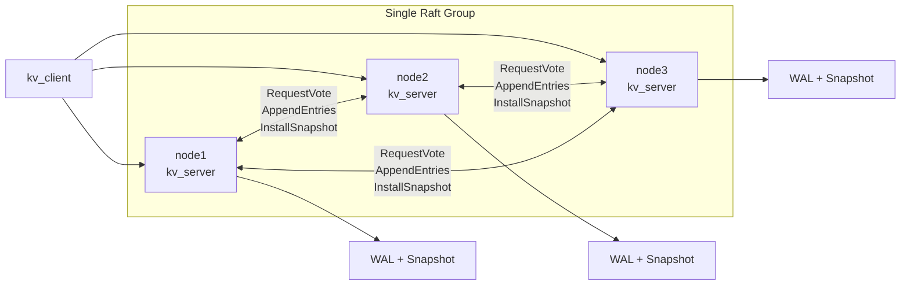

# RaftKV Strong Consistency

RaftKV is a C++17 engineering prototype of a strongly consistent key-value store built on a single Raft group.

It is intentionally scoped as a reproducible learning and validation project:

- Single Raft group.
- Fixed three-node cluster.
- Strongly consistent `Put` / `Get` / `Append` / `Delete`.
- Crash recovery with WAL and Snapshot.
- Not a production database.

The project focuses on correctness, recovery, observability, benchmark discipline, and interview-readable engineering evidence. It does not try to become a full distributed database.

## Capabilities

- Leader election.
- AppendEntries log replication.
- Majority commit before state-machine apply.
- WAL with checksums, corrupted-tail truncation, and fail-closed metadata recovery.
- Atomic Snapshot write, Snapshot recovery, and InstallSnapshot for lagging followers.
- Client retry deduplication with `client_id + request_id`.
- Read paths: log read and ReadIndex.
- Leader no-op barrier for current-term read safety.
- PreVote.
- CheckQuorum.
- Bounded AppendEntries batching.
- Admin Status API.
- Raft and KV metrics.
- Seeded chaos test.
- Concurrent linearizability checker.
- Benchmark v2.
- Slow follower and delayed replication matrix.
- Unified validation entry: `scripts/verify.sh`.

## Architecture

The cluster is a fixed three-node Raft group. Clients may contact any node; followers return leader hints and the client retries the leader.


```mermaid
flowchart LR
  Client["kv_client"] --> N1["node1<br/>kv_server"]
  Client --> N2["node2<br/>kv_server"]
  Client --> N3["node3<br/>kv_server"]

  subgraph RaftGroup["Single Raft Group"]
    N1 <-->|RequestVote<br/>AppendEntries<br/>InstallSnapshot| N2
    N2 <-->|RequestVote<br/>AppendEntries<br/>InstallSnapshot| N3
    N1 <-->|RequestVote<br/>AppendEntries<br/>InstallSnapshot| N3
  end

  N1 --> D1["WAL + Snapshot"]
  N2 --> D2["WAL + Snapshot"]
  N3 --> D3["WAL + Snapshot"]
```

More diagrams are in [docs/architecture.md](docs/architecture.md).

## Quick Start

### Dependencies

The full server build needs a Linux environment with:

- C++17 compiler
- CMake
- Protobuf
- gRPC and `grpc_cpp_plugin`
- libgo
- spdlog
- absl dependencies required by gRPC

Alibaba Cloud Linux 3 setup notes are in [docs/build_alinux3.md](docs/build_alinux3.md).

Core tests can be built without the full Raft/gRPC server dependency set:

```bash
bash scripts/test_core.sh
```

### Build

Full build:

```bash
bash scripts/build.sh
```

Fast post-change validation:

```bash
bash scripts/verify.sh fast
```

### Start A Three-Node Cluster

```bash
bash scripts/start_cluster.sh
```

Find the leader:

```bash
./bin/kv_client leader
```

### KV Operations

```bash
./bin/kv_client put name raft
./bin/kv_client get name
./bin/kv_client append name _kv
./bin/kv_client get name
./bin/kv_client delete name
./bin/kv_client get name || true
```

Expected behavior:

- `Put` creates or overwrites a key.
- `Get` returns the value or `KEY_NOT_FOUND`.
- `Append` appends to an existing value or creates the key from an empty value.
- `Delete` removes an existing key or returns `KEY_NOT_FOUND`.

### Status And Metrics

Single-node status:

```bash
./bin/kv_client --servers=127.0.0.1:9001 status
```

Cluster status table:

```bash
bash scripts/show_cluster_status.sh \
  127.0.0.1:9001 \
  127.0.0.1:9002 \
  127.0.0.1:9003
```

Status output is stable `key=value` text for scripts. It includes role, term, leader id, commit index, applied index, log index, snapshot index, WAL bytes, and metrics counters.

## Read Paths

RaftKV supports two read modes.

### Log Read

`log` is the default mode. A `Get` request is serialized into a Raft log entry, replicated to a majority, committed, applied in log order, and then returned to the client.

This is simple and strongly consistent, but every read writes a Raft log entry and touches the WAL/replication path.

### ReadIndex

`read_index` avoids appending a log entry for `Get`. The leader first verifies that it still has quorum authority in the current term, records the current commit index, waits until the local state machine has applied up to that index, and then reads locally.

ReadIndex is not Lease Read. It still needs quorum confirmation and a current-term commit barrier. Leader no-op barrier ensures a newly elected leader can establish that current-term commit point even before user writes arrive.

Configuration:

```yaml
read:
  mode: log        # default
```

or:

```yaml
read:
  mode: read_index
```

## Persistence And Recovery

Each node persists Raft state locally.

WAL stores:

- current term
- voted-for metadata
- committed/applied metadata
- log entries after the latest snapshot
- checksums for corruption detection

Snapshot stores:

- KV data
- client request dedup table
- last included index
- last included term

Restart recovery loads Snapshot first, then WAL metadata and log entries, then replays committed entries after the snapshot index. Corrupted or truncated WAL tails are treated as crash-recovery input and truncated safely; invalid metadata fails closed.

Dedup recovery is part of Snapshot restoration, so `client_id + request_id` remains valid across restart and snapshot install.

## Validation

Use `scripts/verify.sh` as the main entry point:

```bash
bash scripts/verify.sh fast
bash scripts/verify.sh stage <stage_name>
bash scripts/verify.sh pre_push
bash scripts/verify.sh nightly
```

Recommended use:

- `fast`: after every code change.
- `stage`: run one focused integration stage, for example `slow_follower` or `read_index`.
- `pre_push`: before publishing changes.
- `nightly`: full serial regression in a normal Linux SSH environment, preferably inside `tmux` or `screen`.

Examples:

```bash
bash scripts/verify.sh fast
bash scripts/verify.sh stage slow_follower
VERIFY_EXTRA_STAGES="batch_replication read_index" bash scripts/verify.sh pre_push
VERIFY_RUN_ID="nightly-$(date +%Y%m%d-%H%M%S)" bash scripts/verify.sh nightly
```

Full three-node tests listen on local sockets and are intended for a normal Linux/SSH environment. GitHub Actions only runs the fast subset that does not require binding a full local Raft cluster.

## Benchmarking

Benchmark v2 uses the C++ `kv_bench` client and reports throughput, latency percentiles, retry counts, failure counts, and metrics deltas.

Performance reporting is tracked in [docs/performance_report.md](docs/performance_report.md). The project does not publish single-machine numbers as production benchmark claims; they are for regression and optimization comparison.

## Project Limits

RaftKV v1.0 intentionally does not include:

- dynamic membership
- sharding
- Multi-Raft
- MVCC
- transactions
- Lease Read
- authentication
- Kubernetes deployment
- production-grade operations, monitoring, backup, or SLO tooling
- inflight AppendEntries pipeline

The fixed three-node, single-group scope is deliberate. It keeps the project small enough to reason about correctness, recovery, testing, and observability end to end.
