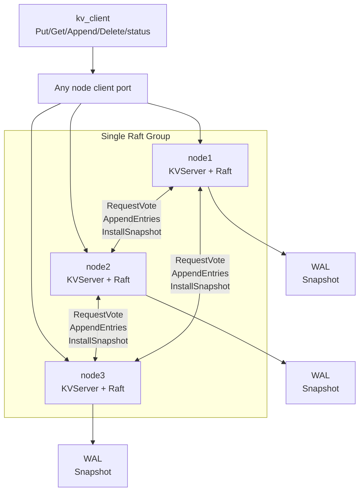
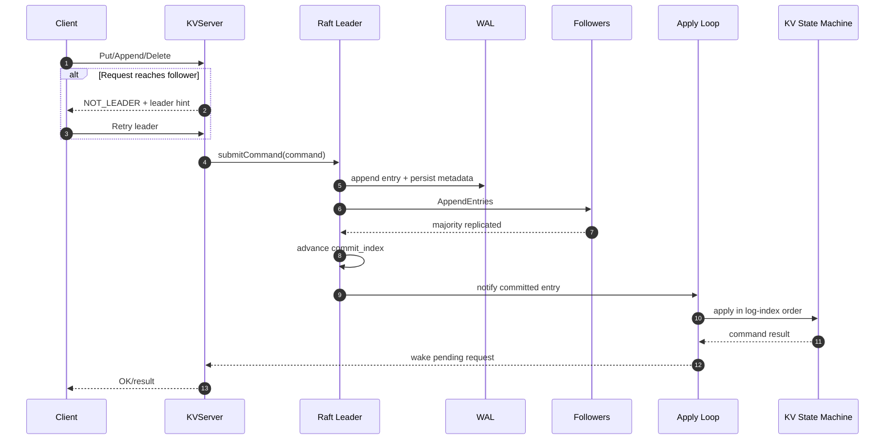
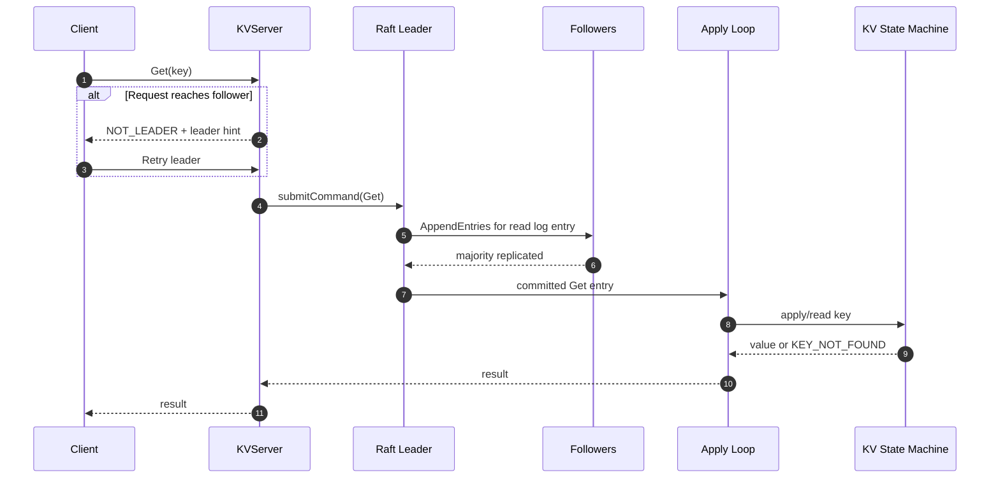
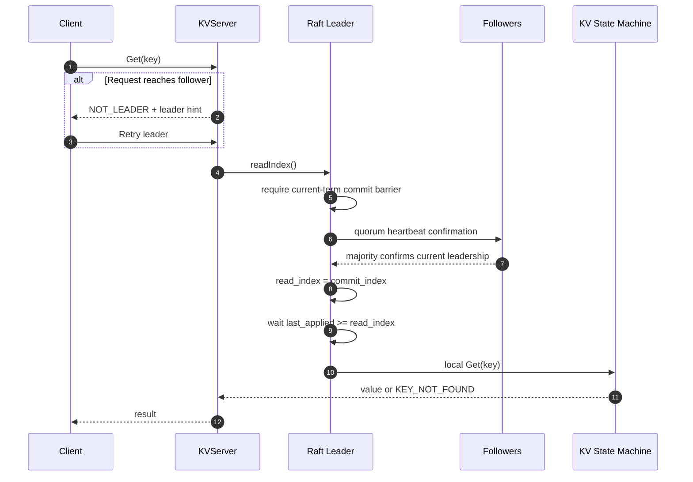
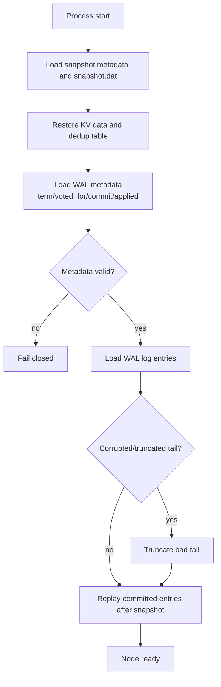
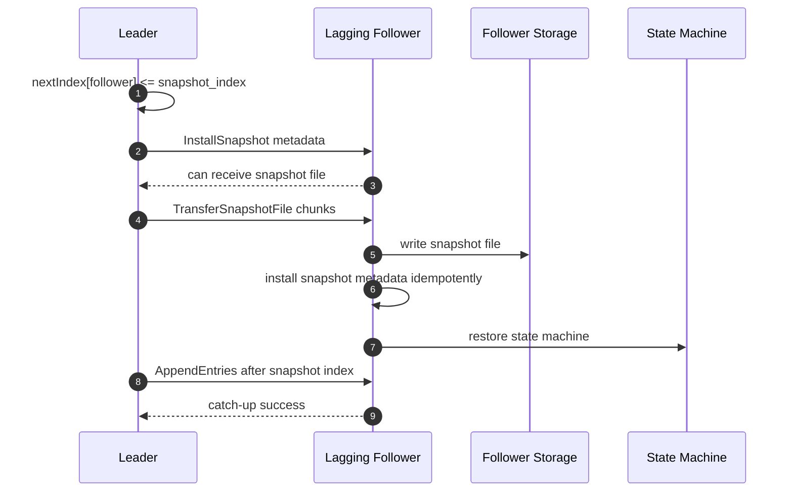
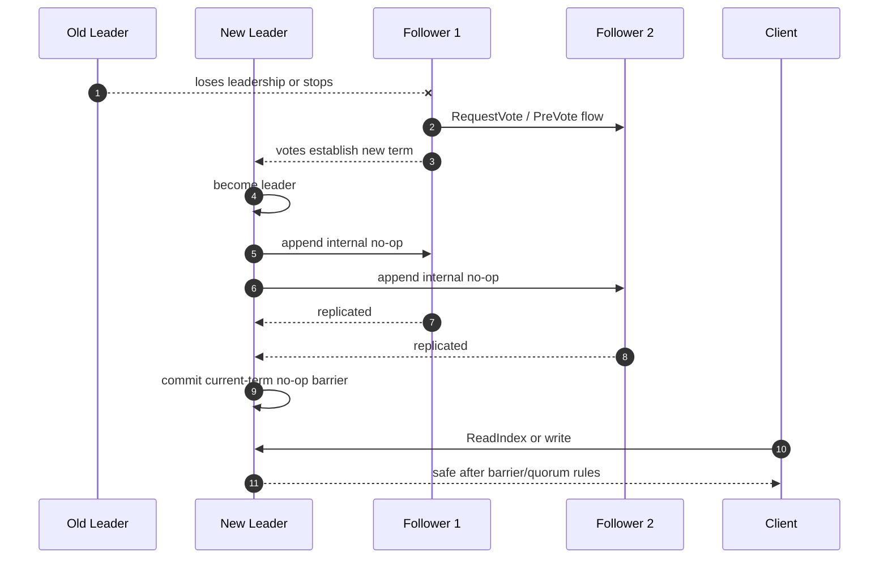

# Architecture

RaftKV v1.0 is a fixed three-node, single-Raft-group KV prototype. The diagrams below are intentionally implementation-level enough for review, but avoid low-level source detail.

## Three-Node Architecture

## Write Request

## Log Read

## ReadIndex

## WAL + Snapshot Restart Recovery

## Lagging Follower InstallSnapshot

## Leader Switch + No-Op Barrier

