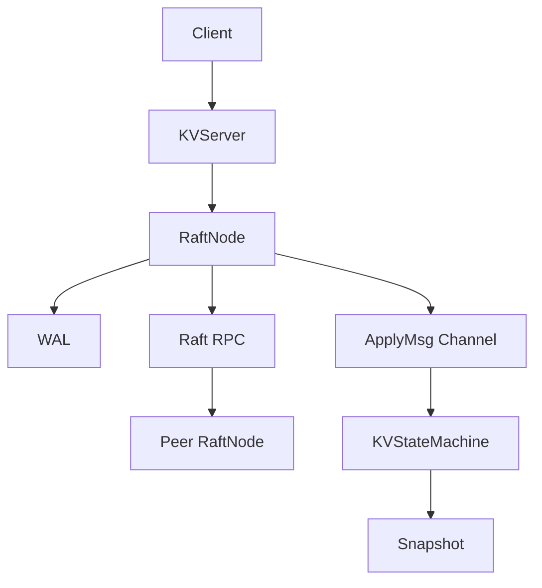

# 设计说明

## 整体架构

项目保留原 cRaft 的 RaftNode、gRPC Raft RPC、libgo 协程调度模型，在上层新增 KVServer 和 KVStateMachine，在下层新增 WAL 与 Snapshot。

## 模块划分

- `RaftNode`：负责选举、日志复制、提交、InstallSnapshot。
- `KVServer`：负责客户端协议、leader 重定向、等待日志 Apply。
- `KVStateMachine`：负责 Put/Get/Delete/Append、请求去重、状态机快照。
- `WAL`：负责 Raft 元数据和日志持久化。
- `Snapshot`：负责保存状态机 payload 和 `last_included_index/term`。
- `RPC`：节点间 Raft 通信仍使用原 gRPC/Protobuf。

## 请求链路

`Client -> Leader -> Raft Log -> WAL -> Majority -> Commit -> Apply -> KV`

1. Client 构造 `ClientRequest`。
2. KVServer 判断当前节点是否 leader。
3. Leader 调用 `Raft::submitCommand`。
4. 日志先写 WAL，再进入内存日志。
5. AppendEntries 复制到多数派。
6. Leader 更新 commit index。
7. Apply 协程按 index 顺序发送 `ApplyMsg`。
8. KVStateMachine 执行命令。
9. KVServer 唤醒等待中的客户端请求并返回结果。

## 去重机制

状态机维护 `last_request_[client_id] = {request_id, result}`。如果相同客户端的请求 id 小于等于已执行的最大 id，直接返回缓存结果，不再执行写操作。该表会写入 Snapshot。

## 持久化边界

WAL 保存 Raft 需要恢复共识状态的数据；Snapshot 保存业务状态机和日志压缩元信息。节点启动时先恢复 Snapshot，再加载 WAL，并 replay `snapshotIndex + 1` 到 `commitIndex` 的已提交日志。持久化的 `last_applied` 只作为辅助元数据，重启恢复不能直接信任它。

## 边界说明

当前版本是简历可控版：支持基础 Snapshot 和日志压缩，不追求完整工业级 InstallSnapshot、动态扩缩容、分片、事务或 MVCC。
